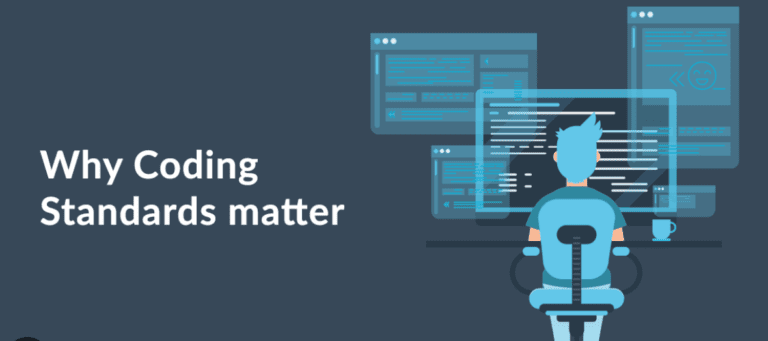

This isn't the first time I've had to follow a certain type of coding style, and I'm sure it won't be the last. And I will say that at first, the idea of having to code in a pre-set style does feel like quite a hassle and annoying at times. But as I code more and learn more about coding style, I start to understand why they are important and more and more get used to them      

## Annoyance at First

My first encounter with the idea of coding style is definitely not what I would call smooth. Trying to remember what the rules were and having to check my code over and over just to make sure it was the right style definitely causes frustration. It also slows me down quite a bit in trying to finish my code. Overall, the first time I had to use a set style to code was not enjoyable. 

The biggest problem I had with this was that I was able to read the code I made perfectly fine, so having to go through all the hassle just to make the code a little bit more readable seems annoying and unnecessary. But as I get used to the coding style, these things become less and less of a problem.

And later I start to see why coding style can be useful and necessary, and the main point isn't so I can read the code, but so that other programmers can read my code.

## Necessity of a Coding Style

After using and learning a bit more about coding style, I started to understand why it's important and accept why we need it. The idea of using the same coding style or a coding standard is not just for organization and your own readability, but so that other developers can look at you're code and understand it quickly. It's so everyone can pick up someone else's code and read through it without issue, and be able to use it for future projects. 

Having a coding standard can make working in a team on different projects more efficient and more organized. It's a great concept, and it helps save time so people don't need to keep asking each other what their code meant.

## ESLint

Now, as for ESLint, I will say I did find it really annoying at first. Not because of anything else, but because some of the settings were wrong when I set it up in VSCode, and it keeps changing my ' to " and keeps giving me an error. I was able to fix it after deleting some of the optional settings that my assignment to me to put on, though. As for the whole thing as a whole, I think it's great. It's nice that it can tell me when I accidentally made a mistake in the style. Not having to check over and over again is great and a huge time saver.

## Overall View

Overall, I am starting to understand more and more the idea and functions of coding standards. It helps make the experience of coding with others a lot smoother. And as for ESLint, I think it's a great tool to use to make sure you don't miss anything.
