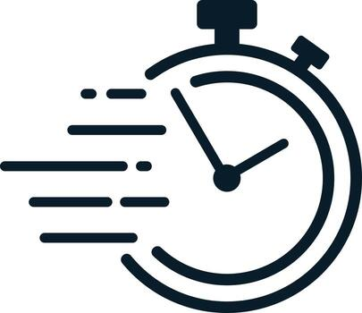

This is the first time I had to actually take notes and make an effort estimation but I have made estimation before starting to work on a project before. Even though 

Most of the time it's just a rough estimation after reading the instructions with no documentation but the process is similar. But this project was the first time

I actually wrote everything down and it had seemed really useful.      

## 1. How did I make Effort Estimates

The way I make my estimation is first read through all the instructions of a task and divide them into different smaller sections. Afterward I make a general demonstration on the 

longer side then add a couple minutes in case of unexpected issues. Afterward I add them all up and round them to the closest hour or half hour to make my estimation.

## 2. Benefits even if Estimation was Wrong

Some benefits it provided me was it can make my next estimation a bit more accurate. Since I documented everything this time I can check on how long it took me on similar work load

and make a better estimation on how much time I need next time. It can also help me tweak how much I'm estimating like how long I should expect an unexpected issue would take to fix.

## 3. Was tracking Actual Effort 

Tracking the actual effort was useful since it gave me a way to compare my estimation and judge if I over or under estimated.

This helped me set better estimations and consider why my estimation might be off.

## 4. How I Track My Actual Effort

I would write down the start time of when I start working and the end time. Then do the calculation afterward. If I needed to leave in the middle I would record 

the time of leaving and when I return then calculate the total work time.

## 5. Reflection

Next time I would make my estimation a bit more generous with the time and also give more time of subjects that I'm not to confident about.

Since more of the issue with the estimation was bugs and issues that I didn't know would happen before hand.
