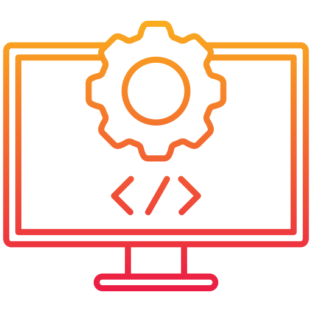

The ICS314 course has taught me a lot of different subjects, most of them are heavy on web design, but also a lot of things about software engineering in general. Some of the main topics that really stood out to me were Open Source Software Development, Coding Standards, and Agile Project Management.      

## 1. Open Source Software Development

This one is definitely what stood out to me the most just because of how much we used it and how useful it was. Open source software development is the process of creating programs and projects with publicly available codes. Things like Bootstrap 5 is one example of how we used it in the class. I found these openly available codes really useful and organized with everything being already set up and easily accessible. This topic does not only apply to web development either since there are many different open source codes that are made for all sorts of fields, not just web development. 

## 2. Coding Standards

This is another topic that stood out to me, and at first it was definitely a bit of a hassle and even now sometimes it still is, I have come to appreciate how useful it can be. It's a way for different programmers to be able to communicate and work with each other better without too many communication issues. This also has many other applications beyond web design as well since coding standard is used for pretty much all projects with multiple programmers. 

## 3. Agile Project Management

Agile Project Management is a way to manage a project where many people are working on. The method we use this semester is issue driven project management. The idea is to focus on what problems we need to solve first instead of thinking what task we should do first. It's to first find all the problems that the project is facing and work through it depending on the priority of the problems. We use these methods in our final web project. This method and many other different methods can all fall under agile project management and is a core part of starting and managing any programming projects. 

## 4. Reflection

Overall even though the main focus on ICS314 was on web development, a lot of the methods we learned and use in the class can also be used with many other types of project as well. No matter if it's how to write the code, how to organized it, or how to mange and move the project forward.

