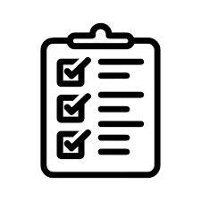

*Difficulty: a thing that is hard to accomplish, deal with, or understand.*

Ever since I heard of the conect of coding when I was still in elementry I was intrested in the conecpt. But durring that time I always view it as something that is a but out of reach. Since the idea of programming with ones and zeros sounds like a headache to me at the time. 

However, that change after I took my first coding class durring high school. That class help me get a better idea of what coding is actually like and it showed me that maybe it's not that far out of my reach as I thought.

## Start of coding

The start of my intrest in coding started with my love of video games when I was young. I always found the idea of being able to design and create a world with code fascnating. This was what spark my interest in this field. Later in high school I was able to experince what actual coding feels like and that drew me in even more. 

It showed me that coding wasn't just trying to memorize thousands of different syntax but more of using and development different functions and tools for problem solving. I loved the process of desgning my own program to do certain tasks. Even though the process of debugging the code can be frustrating at times but it's also really rewarding when I was finally able to find the problem and fix it. 

It somtimes can be hard to get going with a new coding project but once I was able to start get a few lines of code in I often find myself getting really immerse in the prosses. This was espcialy the case when it comes to personal projects and this is what really rooted my interest in coding and software development. 

## Current Goals and Hope for Growth

My current goals for growing in software development is to be able to get more fimliar with differnt types of coding language and setups. I want to be able to get to the point where I'm able to be given a coding language and be able to pick it up and start coding at my normal level in a few hours at most. 

Another thing I want to be able to learn is more on different feilds of software development like web design. I want to be able to understand and work on all types of programs and softwares and not just fimliar at a few aspects of programming.

But the thing I most want to be able to work on are skills related to game developing since that's where my intrest in coding sprouted from and is still the thing that I'm most intrested in currently. 

## Hope for the future

My current plan for the future is to keep honing my programming skills and work on getting use to working on different types of prjects. I would like to be able to get a entry level job in programming after graduating college and getting my degree. I would like to gain more coding experince this way and improve my skills as a programer and look for different opportunities along the way. 

After this I would like to be able to also work on some personal prjects and if things worked well build a career I can live off and enjoy with the information and skills I learn over the years.

I believed that this is the path I would like to go down that I would enjoy and ultimately able to build a career out of.

