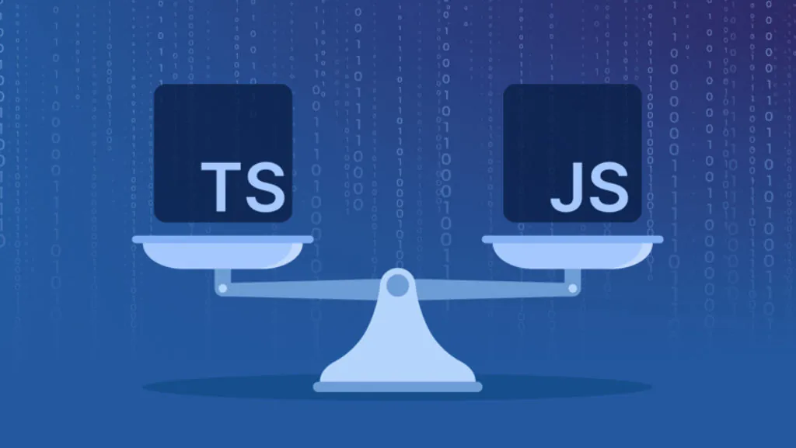

This is the first time I ever use typescript and my first impression is it feels really different from what I'm use too. But there's also many fimliar things to other programming language I use in the past as well. Overall it feels decenlty new but still manageable.      

## The Differences

One of the biggest differences I found intrsting about typescript is the way they handle datatypes. For most of the coding languages I use before we needed to include a datatype or else the code will usally throw an error. But typescript threw a curve ball with it being able to work even without explicitly including the datatype. I understand it's still a good idea to include it anyway but I did found it really intrsting that it will allow you to create a variable without including the datatype yourself.

Another intrsting concept I found is the idea of vari, let, and const. Before I'm use to being ristricted to only allowing one variable to a certain name. The way transcript allows me to chose if I want to do that and being able to create 2 variable of the same name seems intresting to me. I can see how it might be useful at times but it can also casue many unintended issues which is why let and const can be really useful. Still I like that this is still an option. 

The layout and syntax also feels pretty different from other languages I learn before like python, java, and C but it should be fine after getting use to a bit. 

## Similar

Even though a lot of the syntax of typescript looks different from what I'm use to and it also allows for more options in design, the basics of the language seems to be simliar to most other languages. The baisc datatypes seems to be the same and you can also still creat classes and objects in the typescript. 

Typescript still have all the basic commponets of other coding languges I've use and learn before just with a difference emphasis on different parts.

## Overall View

Overall I feel like typescript is an intresting coding language that feels decently different from what I have use before. So far I would say i like the way it's set up and can understand at least the basic of it well. The only thing I'm having trouble with so far is some of the strange syntax it include to shorten or meant to make code more readable. I saw some of these syntax in [FreeCodeCamp](https://www.freecodecamp.org/learn/javascript-algorithms-and-data-structures/#basic-javascript) specifically the ES6 section. It took me a while to understand what it was trying to convey but I think with time and practice I should be able to undsertand what it is saying.

In short typescript is a really new language to me espcially some of the weird syntax it inlcudes. But with time I feel optimistic that I can learn and understand how and where I would use this coding language in. 
