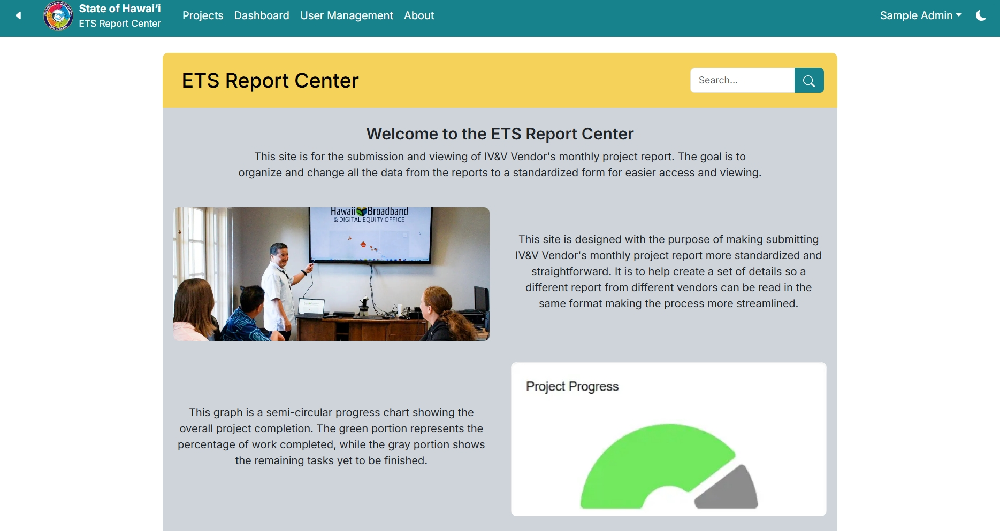
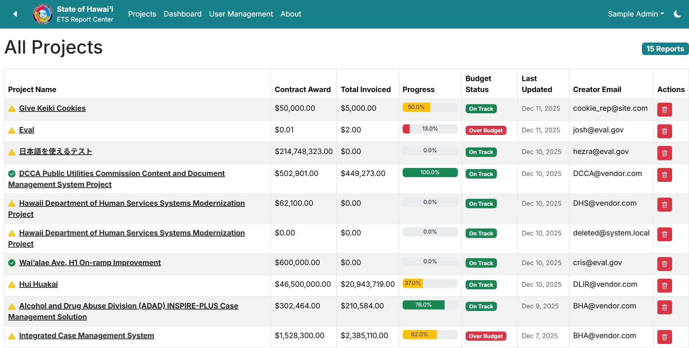
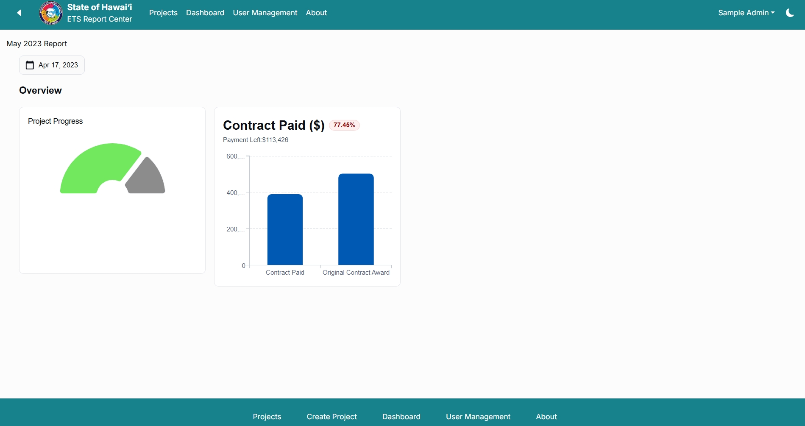
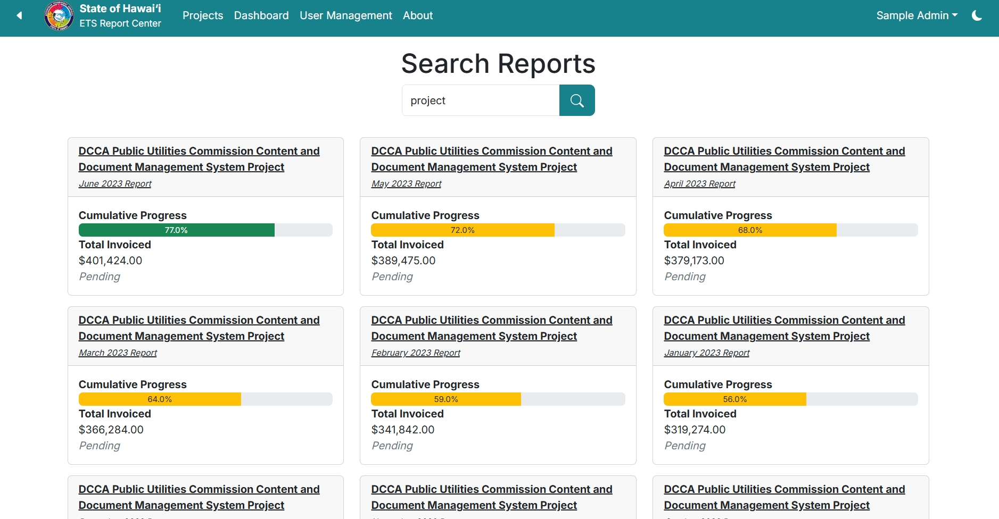
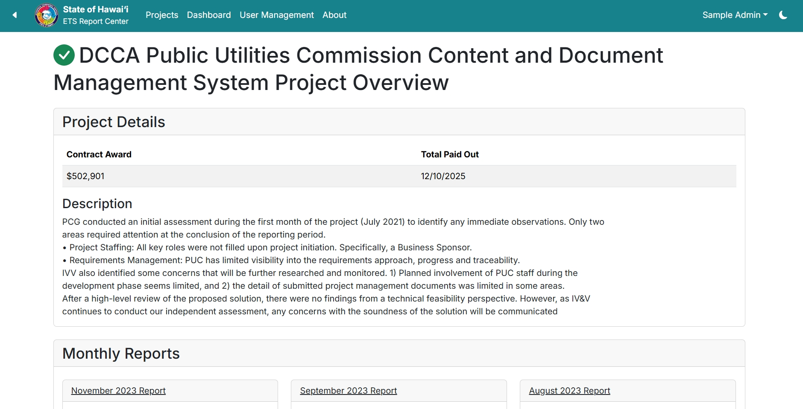

This was the main project the entire semester was building toward for ICS 314. For this project we needed to decide on a website to make use of the skills we learn this semester and since 2 of our group members are doing HACC we decided to use that as our project.

The goal of this website was to make a system where vendors are able to submit monthly reports in a standardized format since currently each vendor has their own style which makes reading all the reports a bit of a pain. 

I mainly worked on some of the UI of the website and was helping with trying to put all the data from the report into the database.

Going through this project really taught me how difficult it is sometimes to get everything to work across a website or a big project in general since sometimes the way you set up a page works fine but it might cause some error on a different page, file, or the database in general. 

This is the link to the organization page with all the source code [link](https://github.com/oh-yeah-ics-314-final-project-7-lets-go).

These are some pages of the final website:

