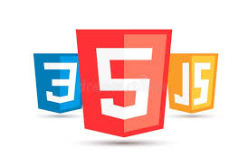

  
  
  

This is one of the projects I done for my coding class back in high school. This was also my inroduction to HTML and coding in general. We were given around 2 weeks to make a website for a shop. 

We use a IDE website call [replit](https://replit.com/) to design the website in HTML. This project got me fimliar with how to code in HTML and experince some of the advantage and disadvantage of using HTML. Like how HTML allow for a high amount of customization but also can be tedious at times for a user of the language.

The website I made was simple since it was my first time working with HTML and desgining a website. I learn a lot about web design and durring this prpject and about what to do and what not to when designing a site. Things like what can become a distraction for a user of the site and how to help user navigate the site.

This is the site I made for the project:

[Website](https://7794f0c2-633a-4d7f-8efa-752b601c335e-00-5w46nnv6orsa.kirk.replit.dev/)

PS. Some of the images might be missing since some images were remove over the years.
